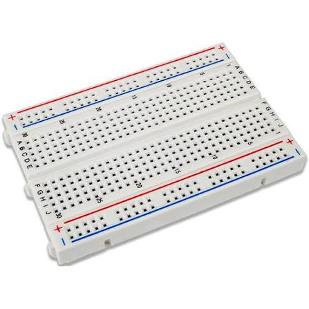
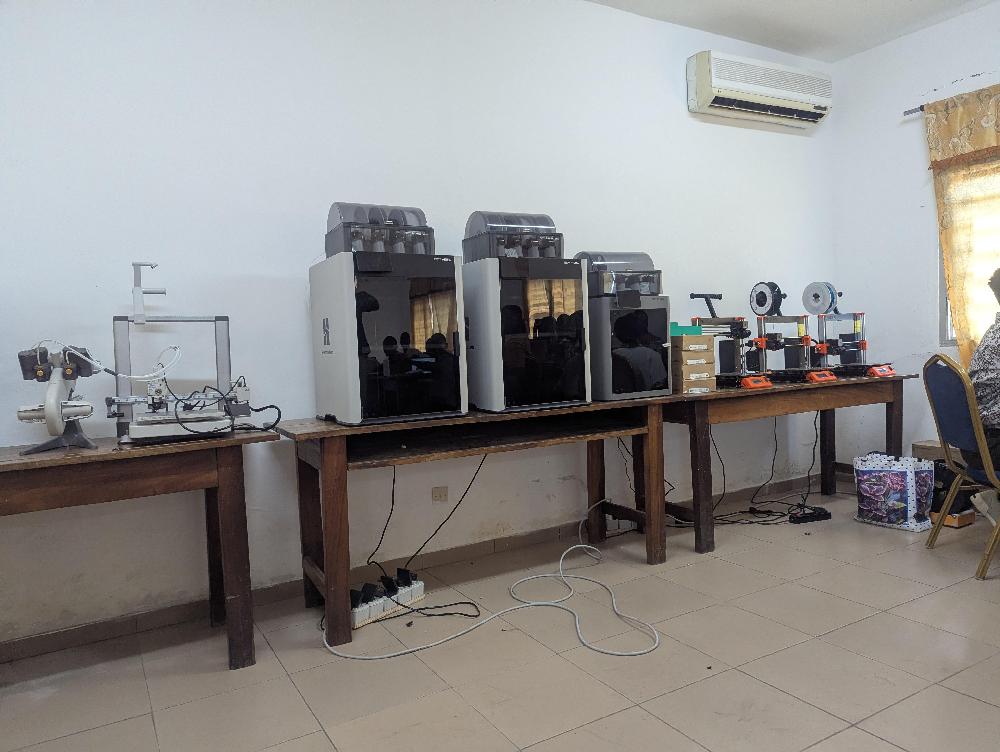

# Journal — mercredi 26 août 2026 (rédigé par : Jean SODJADA)

## Fait aujourd'hui

- Initiation aux **bases de l’impression laser** et découverte des principes généraux de fonctionnement des machines laser.
- Découverte des **bases de l’électronique dans les FabLabs**, notamment de la breadboard et de son utilisation.
- Initiation à la **fabrication additive**, depuis les principes généraux jusqu’à l’impression 3D **FDM (Fused Deposition Modeling)**.
- Découverte et prise en main des machines laser **MetalLab** et **M1 Ultra**.
- Utilisation d’un **multimètre** pour mesurer des grandeurs électriques :
  - tension d’une première pile : **1,5 V** ;
  - tension d’une seconde pile : **0,8 V** ;
  - résistance d’un resistor : **1,998 kΩ**.
- Échanges sur les **projets à réaliser en groupe durant la formation**, notamment sur leur organisation et les prochaines étapes.

## Appris

- J’ignorais le principe de fonctionnement des **impressions laser** ; j’en ai découvert les bases et le fonctionnement général.
- J’ignorais les principes de l’**impression 3D** ; j’ai découvert le fonctionnement de la fabrication additive et de la technologie **FDM**.
- J’ai découvert la **breadboard** et son rôle dans la réalisation et le test de circuits électroniques.
- J’ai appris à utiliser un **multimètre** pour mesurer la tension et la résistance.
- J’ai effectué des mesures de tension de **1,5 V** et **0,8 V**, ainsi qu’une mesure de résistance de **1,998 kΩ**.
- J’ai découvert le fonctionnement général des machines laser **MetalLab** et **M1 Ultra**.
- Les échanges m’ont permis de mieux comprendre les **projets qui seront réalisés en groupe durant la formation**.

## Raté, puis corrigé

- **Difficulté rencontrée lors du paramétrage du logiciel xTool** → [premier contact avec le logiciel donc un peut difficile a comprendre. paramentre aussi regler en anglais] → [reglage du parametre en francais] → [comprehension des parametres et fonctionalités].

## Décidé

- **Reprendre le cahier des charges des projets en groupe** afin de clarifier les objectifs, les responsabilités et les prochaines étapes → lecture approfondie prévue demain.

## À faire demain

-  Reparcourir le **cahier des charges des projets** afin de clarifier les objectifs et les tâches à réaliser 
- Continuer l’apprentissage des **technologies laser**
- Poursuivre l’apprentissage de l’**impression 3D FDM**
