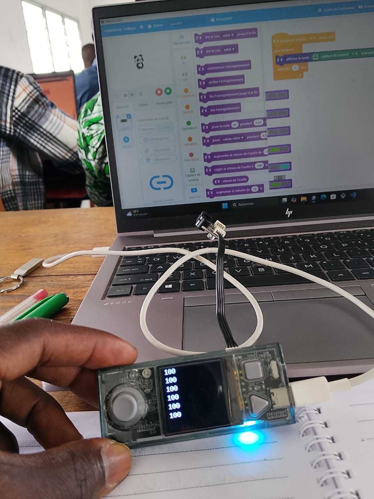
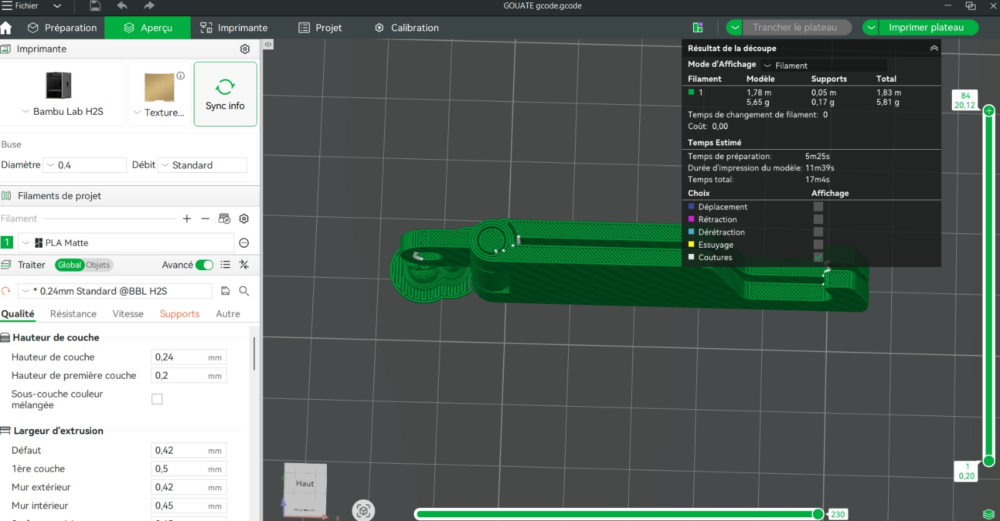

# Journal — vendredi 28 août 2026 (rédigé par : Jean SODJADA)

## Fait aujourd'hui

### Atelier électronique

- Réalisation d’un **TP d’allumage de LEDs contrôlé par un capteur de lumière**.
- Mise en œuvre d’une programmation en blocs permettant de commander les LEDs en fonction des informations fournies par le capteur.

### Atelier impression laser

- Poursuite de la découverte du **logiciel xTool** et de son utilisation pour préparer et lancer des impressions laser.
- Suite des manipulations pratiques liées à l’**impression laser**.

### Atelier impression 3D

- Poursuite de la découverte du **logiciel Bambu Studio** et des machines d’impression 3D.
- Approfondissement du **slicing** et du paramétrage de Bambu Studio pour une machine et un filament donnés.
- Apprentissage du **calibrage d’une machine d’impression 3D**.
- Préparation et lancement d’une **impression 3D**.
- Paramétrage étudié : **sélection de la machine, choix du filament et ajout d’un support**.

### Projet et design thinking

- Échanges sur le **cahier des charges des projets** et sur la manière d’appliquer le **Design Thinking**.
- Discussions sur la manière de penser et sur le **changement de mentalité nécessaire à la réalisation des projets**.

## Appris

### Atelier électronique

- J’ai appris à utiliser la **programmation en blocs** pour commander des LEDs à partir des informations provenant d’un **capteur de lumière**.
- J’ai compris comment associer un capteur à une action de sortie dans un programme en blocs.

### Atelier impression 3D

- J’ai approfondi la notion de **slicing**, qui consiste à préparer un modèle 3D pour son impression.
- J’ai appris à **configurer Bambu Studio** en fonction d’une machine et d’un filament donnés.
- J’ai appris les bases du **calibrage d’une machine d’impression 3D**.
- J’ai appris à préparer et à **lancer une impression 3D**.
- J’ai appris à prendre en compte les **supports** lors de la préparation d’une impression.

### Projet et design thinking

- J’ai appris ce qu’est le **Design Thinking**, une approche de résolution de problèmes centrée sur l’humain.
- J’ai découvert la **méthode spirale** et son intérêt dans le développement progressif d’une solution.
- J’ai appris les principales **étapes du Design Thinking**.
- Les échanges m’ont permis de comprendre l’importance de changer sa manière de penser lors de la conception d’un projet, en partant davantage des besoins de l’utilisateur.

### Atelier impression laser

- J’ai continué à développer ma maîtrise du **logiciel xTool** et de la préparation d’une impression laser.

## Raté, puis corrigé

- **Difficulté à agencer correctement les blocs pour obtenir l’allumage des LEDs à partir du capteur de lumière** → difficulté à comprendre l’organisation logique du programme en blocs → accompagnement et explications des formateurs → réalisation du TP avec le fonctionnement attendu.
- **Difficulté à calibrer Bambu Studio**, notamment pour sélectionner correctement la machine, le filament et intégrer un support → manque de maîtrise des paramètres du logiciel → accompagnement d’un formateur et d’un camarade → paramétrage réalisé et lancement d’une impression 3D.

## Décidé

- **Continuer les exercices de programmation en blocs à la maison** afin de renforcer l’autonomie et la compréhension de la logique de programmation.
- **Me documenter davantage sur la programmation, Bambu Studio et les techniques découvertes pendant les ateliers** afin de mieux maîtriser les outils.
- **Choisir un projet parmi ceux proposés et étudier sa faisabilité en groupe** afin de passer de la réflexion à la conception concrète.

## À faire demain

- [ ] Faire le **choix d’un projet** parmi les propositions du cahier des charges 
- [ ] Discuter en groupe de la **faisabilité du projet choisi** 
- [ ] Identifier les premières contraintes, besoins et ressources nécessaires à la réalisation du projet
- [ ] Poursuivre la pratique de la **programmation en blocs**
