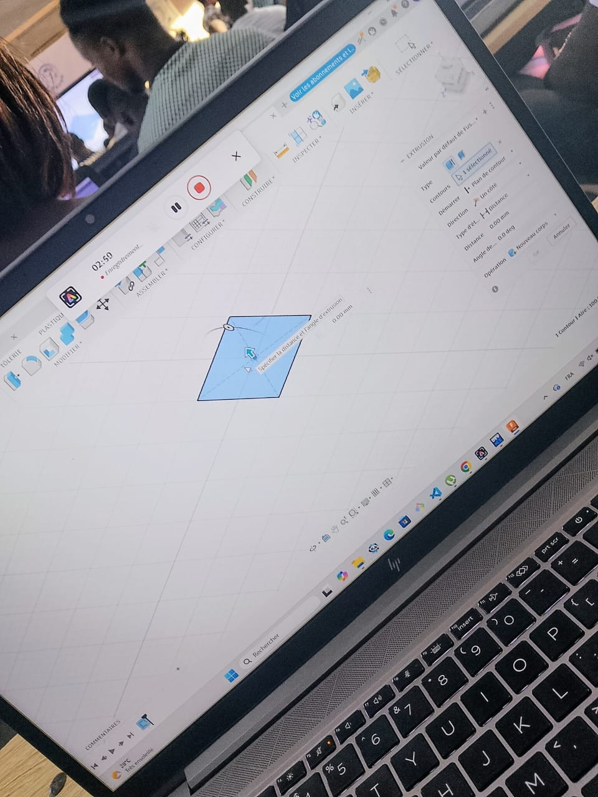
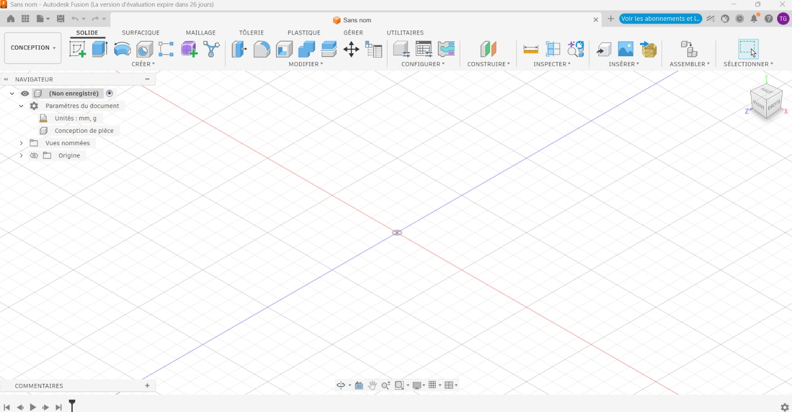

# Journal — lundi 31 août 2026 (rédigé par : Jean SODJADA)

## Fait aujourd'hui

### Suivi et projet

- Réalisation du **contrôle de présence** des participants à la formation.
- Révision du **projet retenu par le groupe** et réflexion sur les différents matériels nécessaires à sa réalisation.
- Identification et sélection des **matériels et ressources techniques** nécessaires à la mise en œuvre du projet.
- Rédaction du **cahier des charges** du projet, en précisant les besoins, les objectifs et les éléments nécessaires à sa réalisation.
- Présentation et **validation du projet** après examen du cahier des charges.

### Initiation à Fusion 360

- Participation à un cours d’initiation aux **bases du logiciel Fusion 360**.
- Découverte de l’interface et des principales possibilités du logiciel.
- Réalisation d’un **premier modèle 3D : un cube**.
- Initiation aux notions fondamentales du **dessin technique** et à leur importance dans la conception d’un objet.

## Appris

- J’ai découvert que **Fusion 360** est un logiciel de conception et de fabrication assistée par ordinateur qui regroupe plusieurs fonctionnalités dans un même environnement.
- J’ai eu un **premier contact avec l’interface et les outils de Fusion 360**.
- J’ai appris à réaliser un **modèle 3D simple**, notamment un cube.
- J’ai découvert les premières notions de **dessin technique**, nécessaires pour représenter et concevoir correctement un objet.
- J’ai compris l’importance de passer par une phase de **conception et de préparation** avant la fabrication d’un objet.
- La révision du projet et la rédaction du cahier des charges m’ont permis de mieux comprendre l’importance de définir précisément les **besoins, les matériels et les contraintes** avant de commencer la réalisation.

## Raté, puis corrigé

- Aucun problème ou échec particulier signalé aujourd’hui.

## Décidé

- **Valider le projet après révision du cahier des charges** et identification des matériels nécessaires à sa réalisation.
- **Poursuivre la prise en main de Fusion 360** afin d’acquérir davantage d’autonomie dans la conception 3D.
- Mettre en pratique les notions de **dessin technique et de modélisation 3D** dans la préparation du projet.

## À faire demain

- [ ] Poursuivre la **modélisation 3D avec Fusion 360**
- [ ] Revoir le **cahier des charges** et les matériels nécessaires au projet — Groupe
- [ ] Commencer à préparer les prochaines étapes de **réalisation du projet** — Groupe
