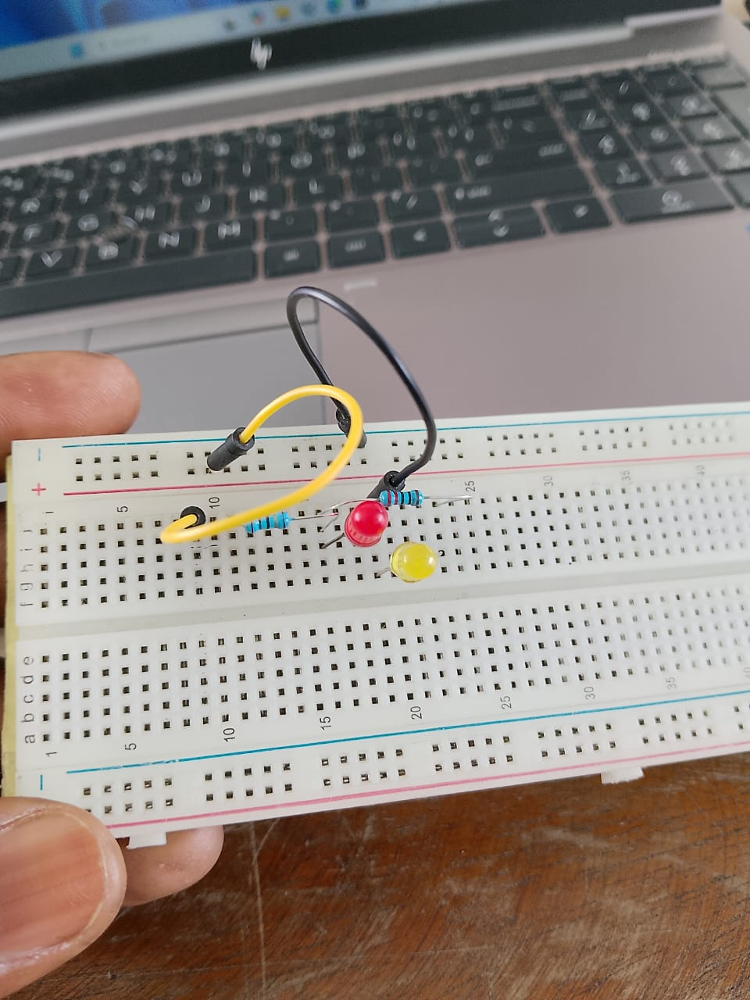

# Journal — mardi 1er septembre 2026 (rédigé par : Jean SODJADA)

## Fait aujourd'hui

### Atelier électronique

- Cours pratique sur la **maîtrise de la Breadboard SK10**.
- Réalisation d'un montage simple : **LED + résistance de 220 Ω + Transistor**.

### Atelier impression laser

- Cours sur l'**impression TDF (Transfert Direct sur Film)** avec la machine **Xtool**.
- Découverte du logiciel **Xtool Creative Space** pour la conception des designs.

### Atelier impression 3D

- Suite du cours sur le logiciel **Fusion 360**.
- Exercice de conception d'un **cylindre** selon **3 méthodes différentes** : extrusion d'un cercle, révolution d'un rectangle, et outil « Cylinder » direct.
.jpg)
.jpg)
- Apprentissage de l'utilisation du **pied à coulisse** (précision 0,02 mm).
- Conception d'un **objet 3D** et d'une **pièce avec gravure intégrée**.

## Appris

### Atelier électronique

- J'ai appris à **organiser les composants sur les lignes de raccordement** d'une Breadboard.
- J'ai compris comment **éviter les courts-circuits** en respectant l'espacement des colonnes.

### Atelier impression laser

- J'ai découvert les **étapes clés de l'impression TDF**

### Atelier impression 3D

- J'ai appris **3 manières de réaliser un cylindre** sur Fusion 360 : extrusion d'un cercle, révolution d'un rectangle, et cylindre direct – chacune adaptée à des contraintes de modification ultérieure.
- J'ai appris à utiliser le **pied à coulisse** pour mesurer des épaisseurs.
- J'ai appris à **intégrer une gravure en creux** sur une face plane.

## Raté, puis corrigé

- Rien à signaler pour cette journée.

## Décidé

- **Prioriser l'apprentissage de Fusion 360** sur les deux autres ateliers cette semaine, car la gravure 3D est critique pour le projet final.

## À faire demain

- Refaire le montage Breadboard avec un **capteur LDR** (mesure de résistance en fonction de la lumière)
- [ ] Finaliser le **design TDF** pour le support de téléphone (intégrer le logo)
- [ ] Modéliser la **pièce complète** (avec la gravure) sur Fusion 360 et l'exporter en STL pour impression 
- [] commencer une version v0 du projet.