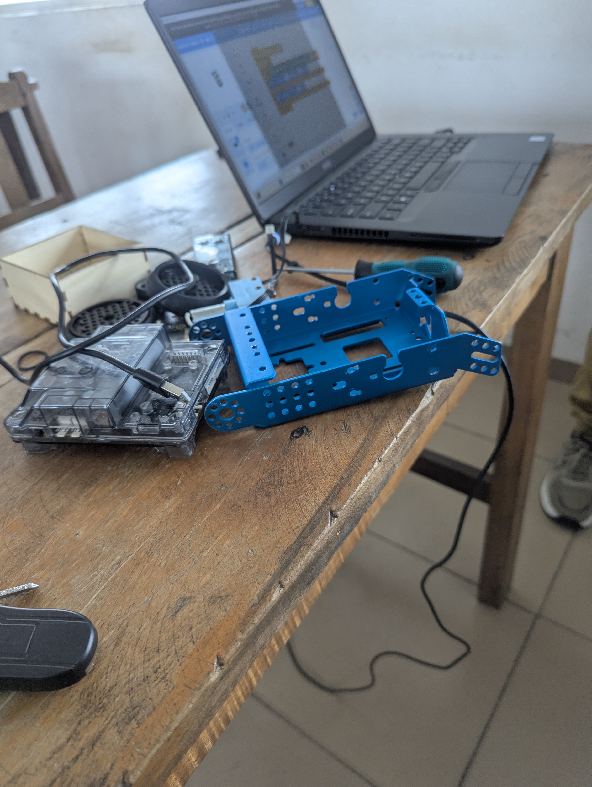
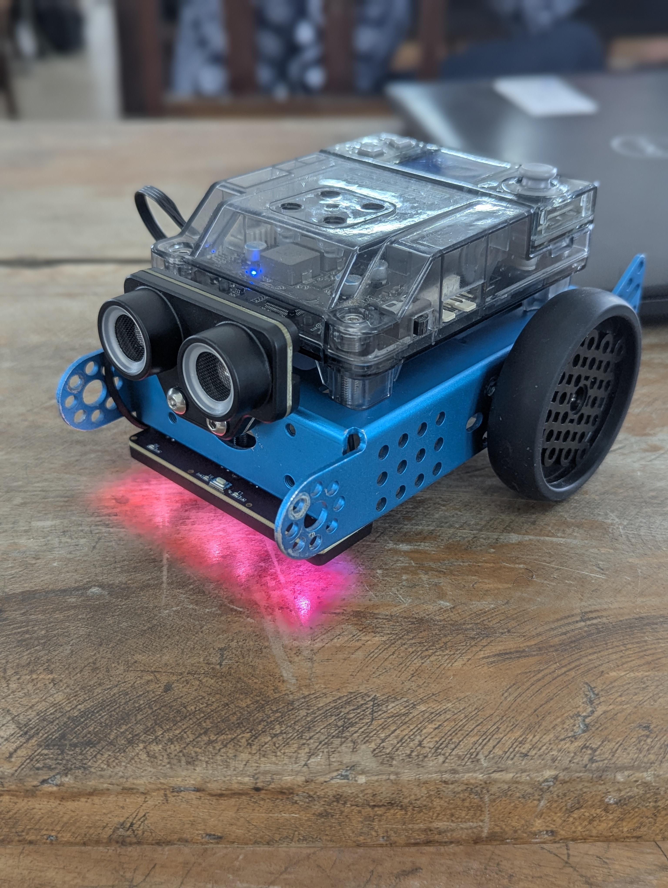
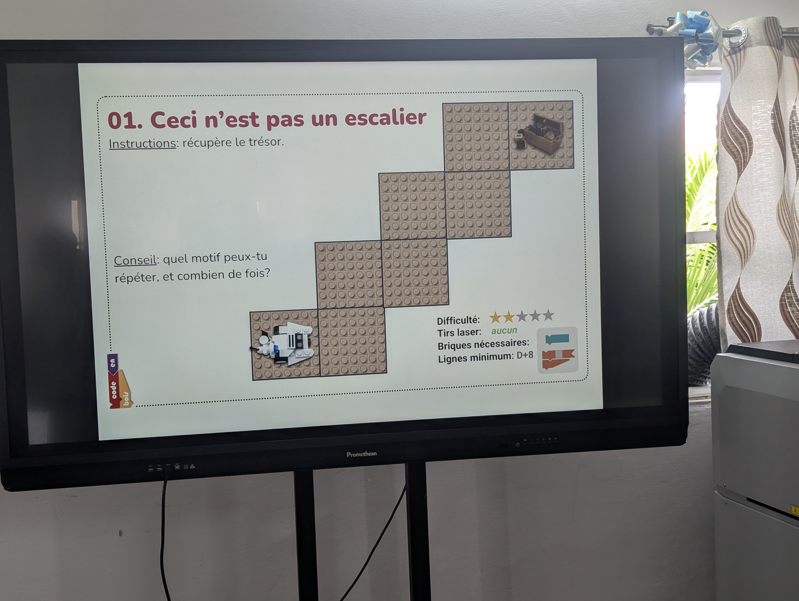
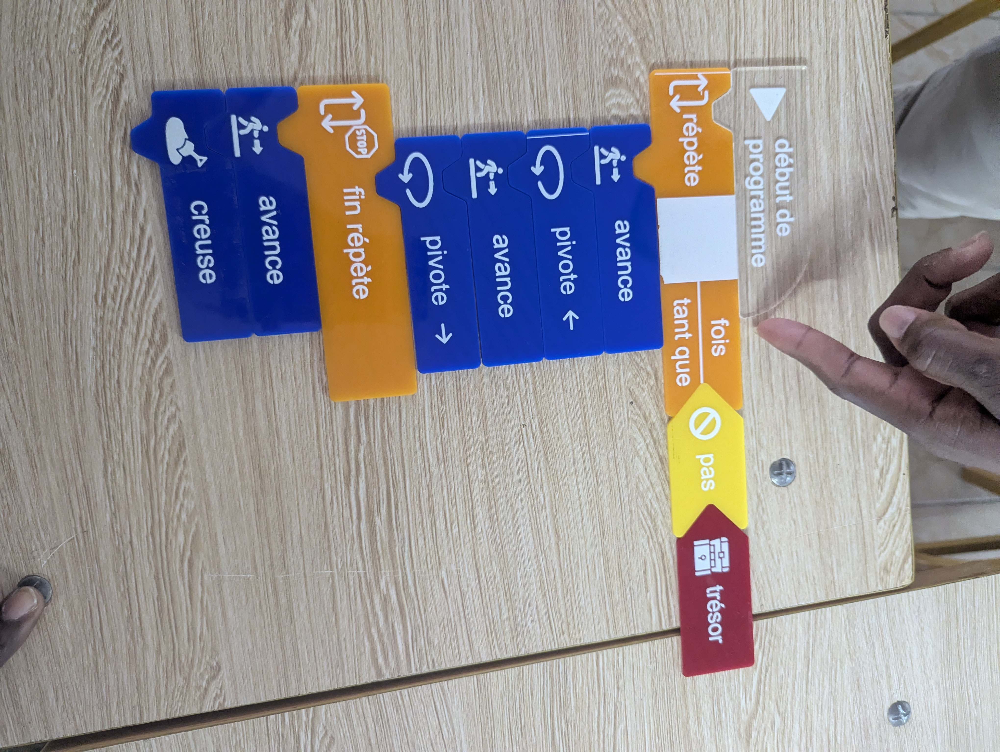

# Journal — mercredi 2 septembre 2026 (rédigé par : Jean SODJADA)

## Fait aujourd'hui

### Atelier électronique

- Montage et démontage du **robot mBot2**.
- Programmation du robot avec le logiciel **mBlock**.
- Réalisation d'un programme permettant au robot d'avancer et de **changer de direction** lorsqu'il rencontre un obstacle (utilisation des capteurs sensoriels).

### Cours sur les bases en algorithme

- Découverte de ce qu'est un **algorithme** et de ses composants.
- Étude de l'**historique de l'algorithme**.
- Résolution d'un problème en groupe : **un robot doit trouver un trésor** en suivant une série d'instructions logiques.

### Projet et modélisation

- Discussion en groupe pour **modéliser notre projet** et définir les premières étapes de conception.

## Appris

### Atelier électronique

- J'ai appris à **monter et démonter le robot mBot2**.
- J'ai appris à **programmer le robot avec mBlock** pour qu'il avance et détecte les obstacles grâce à ses capteurs sensoriels, puis change de direction automatiquement.

### Cours sur les bases en algorithme

- J'ai appris ce qu'est un **algorithme** : une suite d'instructions logiques permettant de résoudre un problème.
- J'ai découvert les **composants d'un bon algorithme** : entrée, traitement, sortie, et conditions.
- J'ai compris l'**historique de l'algorithme** et son évolution à travers le temps.
- J'ai appliqué ces notions en résolvant un problème pratique (robot à la recherche d'un trésor) en groupe.

## Raté, puis corrigé

- **Difficulté à monter correctement le robot mBot2** (repérage des connecteurs et fixation des capteurs) → manque de familiarité avec la structure du robot → suivi d'un **tutoriel sur YouTube** → montage réussi et robot opérationnel.
- **Difficulté à résoudre le problème du robot et du trésor en groupe** (logique de déplacement et conditions à définir) → complexité du raisonnement algorithmique → accompagnement et explications d'un **formateur** → solution trouvée et compréhension renforcée.

## Décidé

- **Continuer l'apprentissage de l'algorithmique** afin de renforcer ma logique de programmation.
- **Commencer les bases en programmation** dès demain pour appliquer concrètement les notions vues.
- **Finaliser la modélisation de notre projet** en groupe pour passer à la phase de conception pratique.

## À faire demain

- [ ] Continuer l'apprentissage de l'**algorithme**
- [ ] Commencer les **bases en programmation**
- [ ] Réfléchir en groupe pour **finir la modélisation de notre projet**
