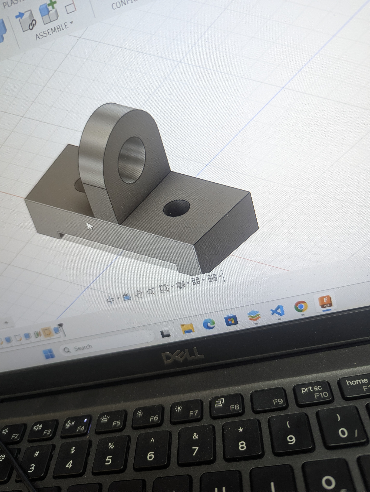
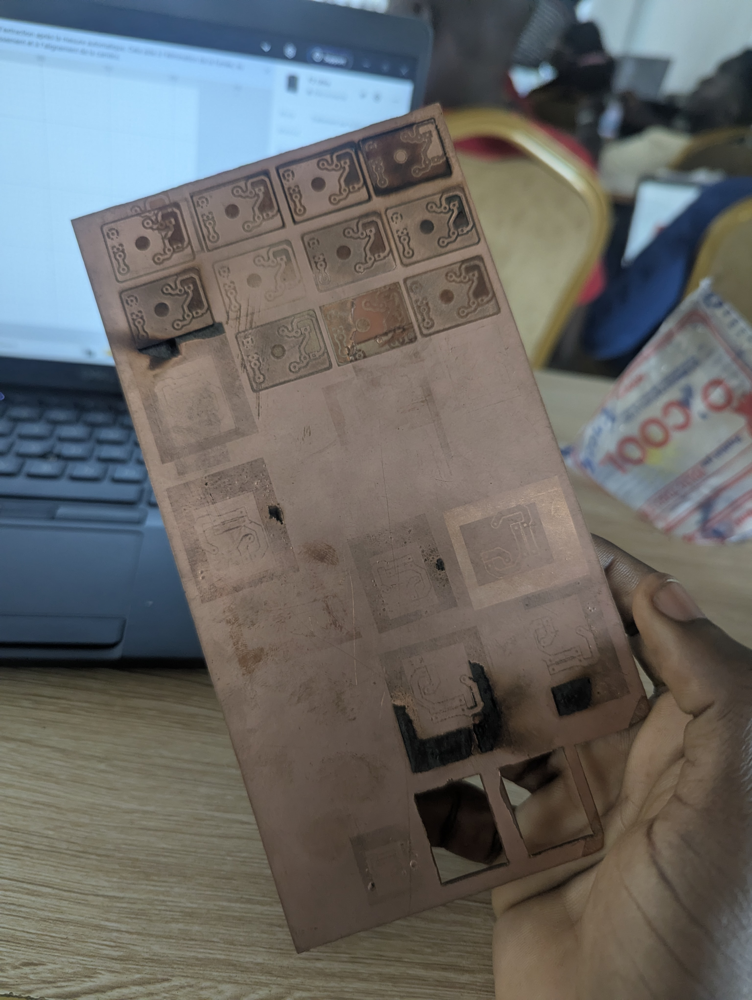

# Journal — vendredi 4 septembre 2026 (rédigé par : Jean SODJADA)

## Fait aujourd'hui

### Suite du cours programmation en Python

- Découverte des **opérateurs indispensables** : arithmétiques, comparaison, logiques et affectation.
- Apprentissage des **conditions** : `if`, `elif`, `else`.
- Apprentissage des **boucles** : `for` et `while`.
- Découverte des structures de données : **listes**, **dictionnaires** et **tuples**.
- Apprentissage de la **définition d'une fonction** en Python.

### Cours sur la fabrication des PCB

- Découverte de ce qu'est un **PCB** (circuit imprimé) et de son utilité.
- Apprentissage des **principales méthodes de fabrication** de PCB :
  - Par **perchlorure de fer** (gravure chimique)
  - Par **papier glacé + fer à repasser** (transfert thermique)
  - Par **fabrication numérique** (usinage ou gravure laser)
- Paramétrage du logiciel **Xtool** pour la réalisation de PCB.
- Réalisation d'un **exercice de conception 3D**
- 

## Appris

### Suite du cours programmation en Python

- J'ai appris à utiliser les **opérateurs arithmétiques** (+, -, *, /, %, //, **) pour effectuer des calculs.
- J'ai appris à utiliser les **opérateurs de comparaison** (==, !=, >, <, >=, <=) pour comparer des valeurs.
- J'ai appris à utiliser les **opérateurs logiques** (and, or, not) pour combiner des conditions.
- J'ai appris à utiliser les **opérateurs d'affectation** (=, +=, -=, *=, /=) pour modifier des variables.
- J'ai appris à utiliser les **conditions** (`if`, `elif`, `else`) pour exécuter des blocs d'instructions selon des critères.
- J'ai appris à utiliser les **boucles `for` et `while`** pour répéter des instructions.
- J'ai découvert les **listes** (collection modifiable d'éléments), les **dictionnaires** (collection de paires clé/valeur) et les **tuples** (collection non modifiable).
- J'ai appris à **définir une fonction** avec `def` et à utiliser des paramètres et des valeurs de retour.

### Cours sur la fabrication des PCB

- J'ai appris ce qu'est un **PCB** (Printed Circuit Board) : une plaquette qui supporte et relie les composants électroniques par des pistes conductrices.
- J'ai compris **pourquoi réaliser un PCB** : il solidifie le circuit, améliore la fiabilité, réduit les erreurs de câblage et permet une production en série.
- J'ai découvert les **principales méthodes de fabrication** :
  - **Perchlorure de fer** : gravure chimique par attaque du cuivre.
  - **Papier glacé + fer à repasser** : transfert thermique du motif sur le cuivre.
  - **Fabrication numérique** : gravure directe par laser ou fraiseuse CNC.
- J'ai appris à **paramétrer le logiciel Xtool** pour réaliser des PCB par gravure laser.
- J'ai réalisé un **exercice de conception 3D** en lien avec notre projet de minuterie d'allumage.

## Raté, puis corrigé

- Rien à signaler pour cette journée.

## Décidé

- **Continuer l'apprentissage du langage Python** pour renforcer les compétences en programmation nécessaires au projet.
- **Réfléchir en groupe au projet** pour avancer sur la conception et la répartition des tâches.
- **Explorer la fabrication du PCB** comme solution finale pour notre minuterie d'allumage, car cette méthode offre une meilleure fiabilité.

## À faire demain

- [ ] Continuer la programmation en **Python**
- [ ] Réfléchir en groupe pour le **projet** (minuterie d'allumage)
