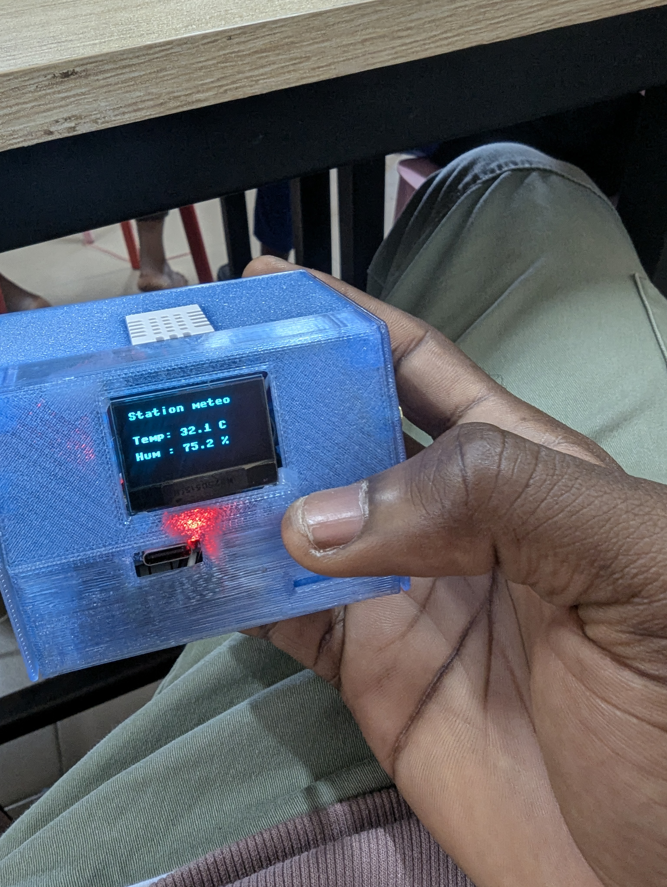
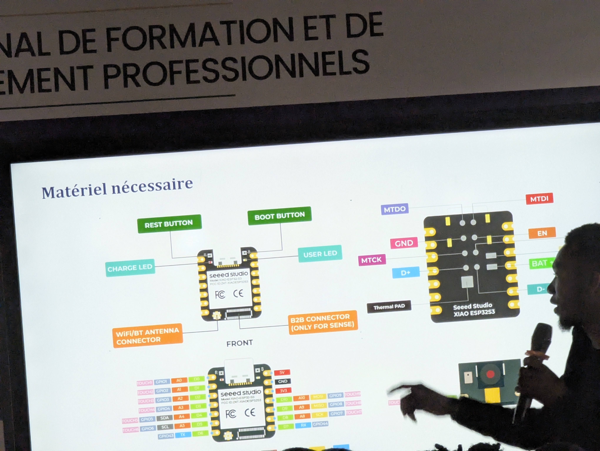
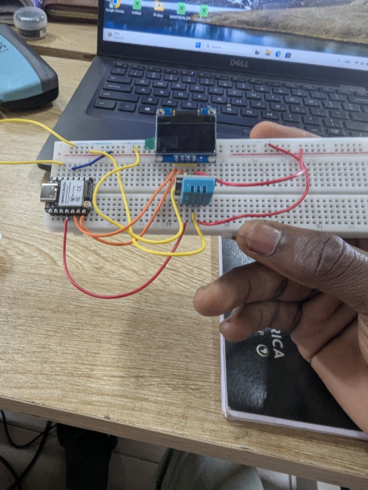

# Journal — samedi 5 septembre 2026 (rédigé par : Jean SODJADA)

## Fait aujourd'hui

### Montage électronique : lecture de la température et d'humidité

- Réalisation d'un montage électronique permettant de **mesurer la température et l'humidité** et de les afficher sur un écran.
- Identification et découverte des **composants électroniques** utilisés :
  - **Xiao ESP32-S3** et ses différentes bornes (broches GPIO, alimentation, communication).
  - **Capteur de température et d'humidité** (type DHT11 ou similaire) et ses différentes bornes (VCC, GND, DATA).
  - **Écran OLED** et ses différentes bornes (VCC, GND, SCL, SDA).
- Montage des composants sur Breadboard.
- Programmation de l'**ESP32-S3** en langage **Python** (MicroPython) pour :
  - Lire les données du capteur.
  - Afficher la température et l'humidité sur l'écran OLED.

## Appris

### Montage électronique : lecture de la température et d'humidité

- J'ai appris à identifier les **composants électroniques** nécessaires pour ce montage :
  - Le **Xiao ESP32-S3** : une carte microcontrôleur puissante avec connectivité Wi-Fi et Bluetooth. J'ai repéré ses **bornes** (broches numériques et analogiques, alimentation 3V3/5V, GND, et broches I2C pour l'écran OLED).
  - Le **capteur de température et d'humidité** : j'ai identifié ses **bornes** (VCC pour l'alimentation, GND pour la masse, et DATA pour la transmission des données).
  - L'**écran OLED** : j'ai identifié ses **bornes** (VCC, GND, SCL pour l'horloge I2C, et SDA pour les données I2C).
- J'ai appris à **monter ces composants** sur Breadboard en respectant les connexions (alimentation, masse, et broches de communication).
- J'ai appris à **programmer l'ESP32-S3** en langage **Python** (MicroPython) pour :
  - Initialiser le capteur et l'écran.
  - Lire les valeurs de température et d'humidité.
  - Afficher ces valeurs sur l'écran OLED en temps réel.
- J'ai compris les bases de la **communication I2C** entre le microcontrôleur et l'écran OLED.

## Raté, puis corrigé

- Rien à signaler pour cette journée.

## Décidé

- **Commencer la réalisation du montage de notre projet** dès demain, en appliquant les compétences acquises aujourd'hui (montage sur Breadboard, programmation de l'ESP32-S3, affichage sur écran).
- **Intégrer la mesure de température et d'humidité** comme fonctionnalité optionnelle de notre minuterie d'allumage, pour enrichir le projet.

## À faire demain

- [ ] Commencer à faire un **montage de notre projet** (minuterie d'allumage) — Jean
