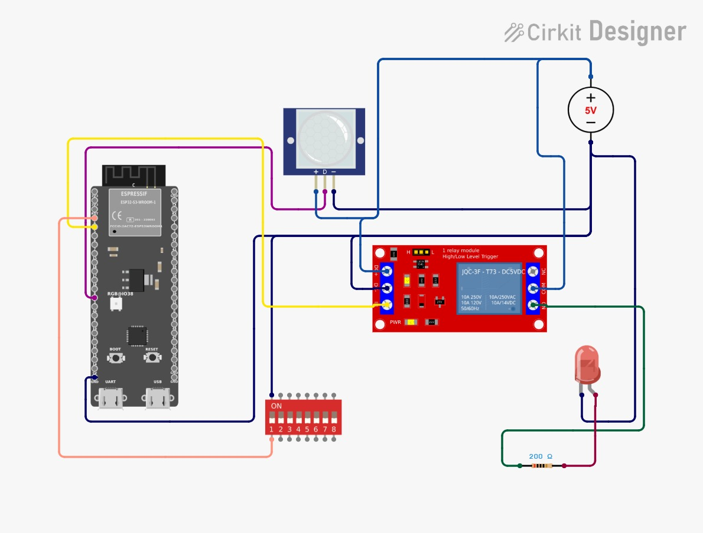

# Journal — jeudi 10 septembre 2026 (rédigé par : Jean SODJADA)

## Fait aujourd'hui

### Travail en groupe sur le projet

- Réalisation d'un premier montage de notre projet : **version 0 (v0)**.
- Objectif de la v0 : **allumer une LED grâce au microprocesseur** (ESP32-S3).
- Échec du montage en raison d'un **problème matériel du microprocesseur** (défaut de la carte).
- Réalisation d'une **simulation** du circuit sur les plateformes **Wokwi** et **Cirkit Designer** pour valider la logique de programmation et le câblage.

## Appris

### Travail en groupe sur le projet

- J'ai appris à **travailler en équipe** sur un projet concret, en répartissant les tâches et en confrontant nos idées.
- J'ai découvert l'utilité des **simulateurs en ligne** (Wokwi et Cirkit Designer) pour tester un circuit et un programme sans matériel physique.
- J'ai compris comment **simuler le montage** d'une LED avec un microprocesseur et vérifier le bon fonctionnement du code avant de passer au montage réel.
- J'ai appris à **diagnostiquer un problème matériel** (microprocesseur défectueux) et à trouver une solution alternative (simulation) pour ne pas bloquer l'avancement du projet.

## Raté, puis corrigé

- **Échec du montage de la v0** : la LED ne s'allumait pas malgré un câblage et un programme corrects → **problème matériel du microprocesseur** (carte défectueuse) → **réorientation vers une simulation** sur Wokwi et Cirkit Designer → simulation réussie, validant la logique du circuit et du programme.

## Décidé

- **Réaliser le montage réel pour l'allumage de la LED** dès que possible, avec un microprocesseur fonctionnel.
- **Poursuivre le projet** en ajoutant le **capteur PIR** (détecteur de mouvement infrarouge passif) pour enrichir les fonctionnalités de notre minuterie d'allumage.

## À faire demain

- [ ] Réaliser le **montage pour l'allumage de la LED**
- [ ] Poursuivre le projet en ajoutant le **capteur PIR**
