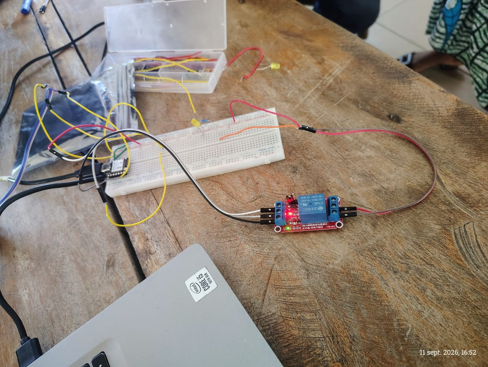

# Journal — vendredi 11 septembre 2026 (rédigé par : Jean SODJADA)

## Fait aujourd'hui

### Travail en groupe sur le projet

- **Réussite de la version v0** : allumage de la LED avec le microprocesseur (ESP32-S3) fonctionnel.
- Branchement du **capteur PIR** pour observer son fonctionnement.
- Récolte et visualisation des **données du capteur PIR** dans la console (détection de mouvement).
- Allumage de la LED en fonction des données reçues du capteur PIR : **réussite**.
- Réalisation d'une **version v3** se rapprochant de notre projet final :
  - Association d'un **relais** au montage.
  - Le relais a bien fonctionné (commutation audible et voyant allumé), mais **n'a pas allumé la LED** → problème de branchement identifié.

## Appris

### Travail en groupe sur le projet

- J'ai appris à **allumer une LED avec un microprocesseur** en contrôlant une broche GPIO.
- J'ai appris à **brancher et utiliser un capteur PIR** : compréhension de son fonctionnement (détection de mouvement par infrarouge passif) et de ses broches (VCC, GND, OUT).
- J'ai appris à **récupérer et afficher les données d'un capteur** dans la console pour les analyser.
- J'ai appris à **conditionner l'allumage d'une LED** en fonction des données reçues du capteur PIR (si mouvement détecté → LED allumée).
- J'ai découvert le fonctionnement d'un **relais** : un composant électromécanique permettant de commuter un circuit de puissance à partir d'un signal de commande.
- J'ai compris l'importance de **vérifier les branchements** : le relais fonctionnait mais la LED ne s'allumait pas à cause d'une erreur de câblage (mauvaise connexion sur les bornes du relais).

## Raté, puis corrigé

- **Le relais fonctionne mais n'allume pas la LED** → **problème de branchement** (mauvaise connexion sur les bornes COM/NO du relais) → **identification de l'erreur** → correction à effectuer demain (refaire le montage avec relais).

## Décidé

- **Refaire le montage avec le relais** en corrigeant le branchement pour que la LED s'allume correctement.
- **Passer au 220 V sous supervision d'un formateur** pour tester le relais dans des conditions réelles (commutation d'une charge secteur).
- **Commencer le PCB du montage** en parallèle, en utilisant KiCad pour concevoir le circuit imprimé de notre projet.

## À faire demain

- [ ] Refaire le **montage avec relais** (correction du branchement)
- [ ] Passer au **220 V sous supervision d'un formateur**
- [ ] Commencer le **PCB du montage**
