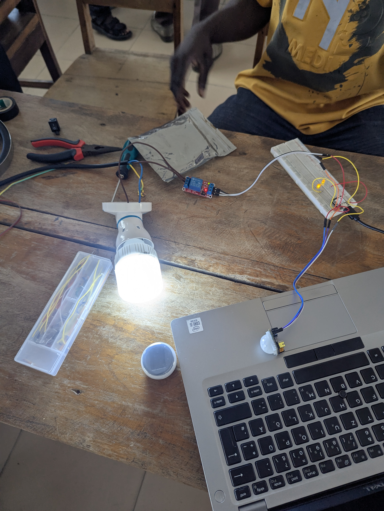

# Journal — samedi 12 septembre 2026 (rédigé par : Jean SODJADA)

## Fait aujourd'hui

### Travail en groupe sur le projet

- Reprise et correction des **montages de la veille** (v0, capteur PIR et relais).
- Poursuite du montage avec **relais** en ajoutant une **lampe sous 220 V** :
  - Test de commutation de la lampe via le relais, commandé par le microprocesseur.
  - **Réussite de la version v4** : la lampe s'allume et s'éteint correctement selon les données du capteur PIR.
- Début du **dessin du PCB du projet** sur le logiciel **KiCad** :
  - Esquisse du schéma électrique.
  - Placement des composants et début du routage.

## Appris

### Travail en groupe sur le projet

- J'ai appris à **corriger un montage avec relais** en identifiant et en rectifiant les erreurs de branchement (bornes COM/NO).
- J'ai appris à **commander une charge en 220 V** à l'aide d'un relais piloté par un microprocesseur, en toute sécurité et sous supervision d'un formateur.
- J'ai compris l'importance de la **séparation entre circuit de commande (basse tension) et circuit de puissance (220 V)** pour éviter tout risque électrique.

## Raté, puis corrigé

- Rien à signaler pour cette journée : les montages repris ont fonctionné correctement après correction des branchements de la veille.

## Décidé

- **Finaliser le PCB du projet** (routage complet et vérification) avant la fin de la semaine.
- **Concevoir le boîtier du projet** pour accueillir le montage final.
- **Valider la version v4** comme base fonctionnelle de notre minuterie d'allumage.

## À faire demain

- [ ] Terminer le **PCB du projet**
- [ ] Terminer le **boîtier du projet**
