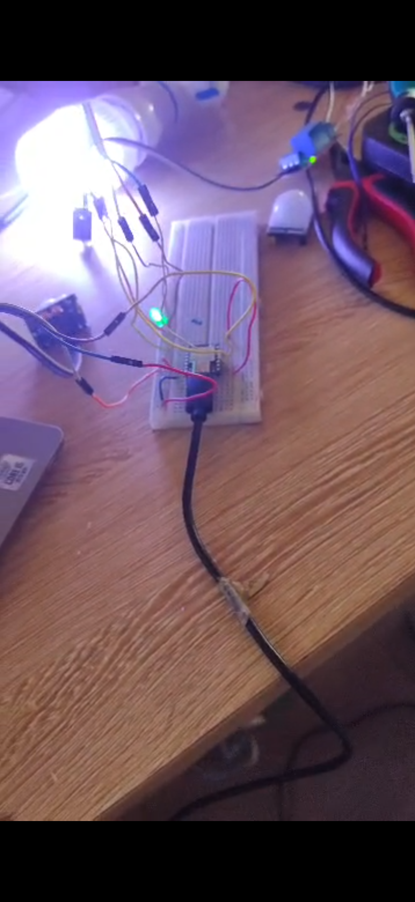

# Journal — mardi 15 septembre 2026 (rédigé par : Jean SODJADA)

## Fait aujourd'hui

### Travail en groupe sur le projet

- Reprise du branchement avec la **LDR simple** : **nouvel échec** à cause des valeurs incohérentes de la photorésistance.
- **Remplacement de la LDR simple par un module LDR** (avec seuil réglable via potentiomètre intégré).
- Paramétrage du **module LDR** pour l'adapter à notre système.
- Reprise complète du **branchement du système** avec le nouveau module.
- Après quelques **ajustements du seuil** du module LDR, le branchement a **réussi** :
  - Le système **éteint automatiquement la lampe allumée**.
  - La LDR **signale l'état éteint** de la lampe au système pour éviter qu'elle ne se rallume automatiquement.
- Début de la réalisation du **PCB du circuit** sur KiCad.

.png)
## Appris

### Travail en groupe sur le projet

- J'ai compris la **différence entre une LDR simple et un module LDR** : le module intègre un circuit de conditionnement (comparateur + potentiomètre) qui permet de régler facilement le seuil de déclenchement.
- J'ai appris à **paramétrer un module LDR** en ajustant le potentiomètre pour définir le seuil de luminosité souhaité.
- J'ai appris à **refaire un branchement complet** en intégrant le module LDR au reste du système (microprocesseur, capteur PIR, relais, lampe).

- J'ai commencé à **concevoir le PCB du circuit** sur KiCad en intégrant tous les composants du projet.

## Raté, puis corrigé

- **Échec persistant du branchement avec la LDR simple** → valeurs incohérentes et impossibles à calibrer précisément → **remplacement par un module LDR** avec seuil réglable → **paramétrage du module et ajustement du seuil** → **réussite du branchement** et fonctionnement attendu du système.

## Décidé

- **Conserver le module LDR** comme solution définitive pour la détection de luminosité dans notre projet.
- **Finaliser la conception du PCB** en intégrant le module LDR à la place de la LDR simple.
- **Valider le système complet** (PIR + module LDR + relais + lampe) comme version fonctionnelle finale du projet.

## À faire demain

- [ ] Poursuivre la réalisation du **PCB du circuit** 
- [ ] Finaliser le **boîtier du projet**
- [ ] Valider le **système complet** en conditions réelles
